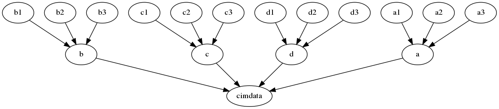
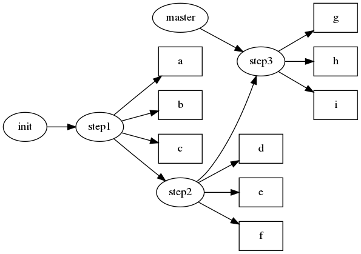
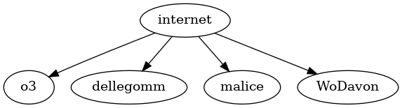

# IT - Coaching #

## git Distributed Version Control System ##

### Mo.-Fr. 12-16.4.2021 ###

#### it-31.1 &amp; it-31vc ####

# Name, Geschichte, Kontext, Hauptmerkmale

[Name & Motto](https://www.youtube.com/watch?v=7cqHtGb9WYM)

 2005 von Linus Thorvald als Ersatz für Bitkeeper gegründet, davor Tarballs

[Linus Thorvalds legendäre Rede über Git (mit (schlechten) dt. Untertiteln)](https://dwaves.de/2013/08/06/linus-torvalds-moves-linux-kernel-to-github/)

## Merkmale ##

 * Zuverlässig (reliability), erreicht mittels SHA-1 Checksummen
 * Performant (schnell)
 * verteilt (distributed) := keine Hauptinstanz als zentrale Autorität mit grant/revoke privileg Problemen
 * content management system

### Randbedingungen ###

 * Man muss nicht jedem im Netzwerk vertrauen, um es zu benutzen.
 * Man muss nicht online sein, um es zu benutzen.
 * Man kann mehrere Zweige (branches) pflegen, etwa für verschiedene Architekturen, Preismodelle (premium/premium ultra/ultra platinum),
   verschiedene Versionen, die aber mit gleichen Bugfixes versorgt werden, Entwicklerzweigen, die später *default* werden.
 * Der Quellcode kann über viele Entwickler verteilt werden, die unabhängig voneinander den Code weiterentwickeln.

## alternative Produkte ##

 * RCS
 * CVS
  - Subversion ("CVS done right")
 * Parfoce
 * Mercurial
 * Bitkeeper
 * rsync
 * time machine
 * bazaar
 * ...

### Kritik ###

Kritik an Konkurrenzprodukten:

 * Merging (Zusammenführen) ist schwierig bei CVS/Subversion.
 * Bitkeeper ist ein kommerzielles Produkt, hat aber eine Open-Source-Exception
 * viele Tools zentralistisch organisiert
 * viele Tools nicht performant

## Snapshot vs. Diff ##

Snapshot-basisert vs. Diffbasisert

# Vorbereitung, benötigte Tools

## Linuxinstallation ##

(geht auch mit Mac/Windows)

 + Download [xubuntu-20.04.2-desktop-amd64.iso](http://ftp.uni-kl.de/pub/linux/ubuntu-dvd/xubuntu/releases/20.04/release/)  (ca. 1.6 GB)
	(Jede andere Version geht auch, bei anderen Linuxversionen, die etwa mit yum statt apt installieren, muss man diese Installationsprogrammaufrufe anpassen)
  - Sha-256 Kontrolle
 + Einrichtungsdialog VBox:
	- Name: Frei wählbar, kurz, ausdrucksstark (Bsp.: ubu20)
	- System: Linux
	- Typ: Ubuntu 64bit
	- Arbeitsspeicher: (Hälfte dessen, was die echte Maschine hat, 4GB ist gut)
	- Festplatte erzeugen/dynamisch/10 GB
	- Systemprozessor: 2 CPUS (nicht mehr, als man wirklich hat)
	- aktivieren: Netzwerkbrücke, Drag'n'Drop & Zwischenablage bidirektional
	- Iso-Image vom Downloadort auswählen, starten
 + Basisinstallation
	- Name, Sprache, Location, Maschinenname
	- Aktualisierungen nicht automatisch mitziehen, sonst gehen Einstellungen verloren
 + Nach Installation und Reboot Klon erzeugen, um
 + Aktualisierungen installieren
	- Vollbildmodus, In Ubuntu: Über Menü:Einstellungen: Suchfeld mit Lupe nach "Bild", "Anzeige" wählen, Auflösung z.B.: 1250x1024 wählen
	- Einstellungen Leiste, 2. Leiste für unten, Arbeitsflächenumschalter, Trennelement
	- Schriftgröße Terminal, Schriftgröße, Zeilen, Spalten
	- Runterfahren, Klonen, neu booten
	- Einstellungen/Fensterverwaltung/Theme: Default um breiteren Rand zum Anfassen zu bekommen.

## Benötigte Tools ##

	- Nachinstallieren, wenn noch nicht vorhanden: git, geany, sl, mc, inkview, dot ...

```bash
	sudo apt install geany mc git sl inkscape xdot make cpp
```
	- Einstellungen 1. Leiste + Starter: Geany, Einstellungen, Terminal, Firefox,

# Git #

Zur Abgenzung von anderen Aktivitäten im System erzeugen wir einen neuen Ordner,
in dem wir arbeiten, beispielsweise `git` (gerne in einem Unterordner kurs/, cimdata/
oder wo immer man bisher Kursprojekte begonnen hat.:

```bash
cd
mkdir git
cd git
```

Primär machen wir uns für Git bekannt, in dem wir usernamen und Email (hier gerne
eine Fake-Email) angeben.

## git config ##

```bash
git config --global user.name "Rudi Ratlos"
git config --global user.email ratlos.rudi@spr.eu
```

Sollten wir später eine echte Emailadresse benötigen können wir sie immer noch ändern.

## git init ##

Mit `git init` machen wir den aktuellen Ordner zu einem Git-Repository (Speicher, Depot, Magazin).

```bash
git init
git status
```

## git status ##

Mit `status` lassen wir uns den Stand der Dinge anzeigen.

## git help ##

**Hilfe** zu git Kommandos gibt es auf 3 analoge Weisen:

```bash
git help init
git init --help
man git-init
```

## git add ##

Im Verzeichnis erzeugen wir ein Unterverzeichnis `experiment` und fügen es dem Repo
hinzu.

```bash
	git add experiment
	git status
```

Das Zufügen ist ein vorläufiger Vorgang. Man kann mehrere *adds* die zusammengehören
sammeln, und dann gemeinsam mittels `commit` (ausführen) festschreiben. Geänderte
Dateien müssen erneut hinzugefügt werden.

## git commit ##

```bash
	git commit
```

Es öffnet sich ein Editor, in dem wir in der 1. Zeile die Änderung knapp beschreiben.

Nach einer Leerzeile kann dann eine ausführliche Beschreibung der Änderungen folgen.

Der zu nutzende Editor kann umgestellt werden, per default ist es vi(m).

```bash
	git config --global core.editor mcedit
```

Als Kommentar für unser Commit geben wir etwas wie "Initial Release" oder "Projektgründung" ein.

Alternativ kann man - insbesondere bei kurzen Kommentaren - auch den Kommentar auf der
Kommandozeile eingeben (-m wie Message):

```bash
	git commit -m "Version 0.1 alpha"
```

Wir wechseln ins Verzeichnis `experiment` und arbeiten fortan von da.

Zur Simulation von Programmiertätigkeit mit gut sichtbaren Auswirkungen benutzen wir
das Tool xdot bzw. dot.

Wir erzeugen eine Netz- bzw. Baumstruktur aus mehreren Dateien, die wir unabhängig
voneinander ändern können.

{ width=100% }

Diese soll im Laufe der Zeit angepasst werden.

Wir benutzen dafür eine Hauptdatei, Netzwerk.dot.base

```c
digraph Netzwerk {

#include "a.dot"
#include "b.dot"
#include "c.dot"
#include "d.dot"
}
```

die die Hülle abgibt. Diese benutzt C/C++-Syntax, um andere Dateien einzubinden.

Bevor wir diese anderen Dateien erzeugen fügen wir Netzwerk.dot.base unserem Repo
hinzu

```bash
	git add *base
```

Der add-Befehl akzeptiert eine ganze Liste von Dateien. Mit Wildcards bringt man die
Shell dazu, mehrere Dateien (sofern vorhanden) für das Repo zu `stagen`. (Stage,
die Bühne).
Das vorläufige Resultat betrachten wir mit

```bash
	git status
```

Die Datei a.dot sieht so aus, die anderen Dateien entsprechend:

```xdot
a -> cimdata
a1 -> a
a2 -> a
a3 -> a
```

Auf jeden Subknoten (a, b, c, d) weisen 3 Unterknoten x{1,2,3}.

Die eben erzeugten Dateien `[a-d].dot` lassen sich leicht mit einem Miniscript `init.sh` erzeugen:

```bash
	for c in {a..d}
	do
		echo "$c -> cimdata" > $c.dot
		for i in {1..3}
		do
			echo "$c$i -> $c" >> $c.dot
		done
	cat $c.dot
	echo
	done
```

Die dot-Files sind dem Projekt hinzuzufügen (add). Das Initscript nicht.

Um Dateien auszuschließen, ohne dass git jedesmal nachfragt, ob diese nicht zugefügt werden sollen,
legt man eine Datei an namens .gitignore:

Rufen Sie vor erzeugen der .gitignore-Datei und danach `git status` auf.

```bash
	init.sh
	*.log
	dir1/
```

Mit dem C-Präprozessor `cpp` lassen sich die include-Dateien in die Hauptdatei übernehmen.

```bash
	cpp Netzwerk.dot.base -o Netzwerk.dot
```

Dieser hinterlässt jedoch Kommentare, die zwar unschädlich für die dot-Programme sind,
aber unschön. Ein Sedbefehl (besser gesagt 3) lassen diese verschwinden:

```bash
	sed -i "/# .*/d;" Netzwerk.dot
```

Um diese Kommandos nicht jedesmal neu tippen zu müssen hinterlegen wir sie in einem
Makefile:

```make
default: Netzwerk.dot
	dot -T png -o Netzwerk.png Netzwerk.dot

base: Netzwerk.dot.base
	cpp Netzwerk.dot.base -o Netzwerk.dot && sed -i "/# .*/d;" Netzwerk.dot
```

Dies definiert 2 Ziele, default und base.

 - Default hängt ab von der .dot-Datei. Hat sich diese geändert, muss die PNG-Datei
 neu erzeugt werden.
 - base hängt ab von der .base Datei. Der Präprozessor cpp macht aus der eine neue .dot-Datei
 und sed räumt diese auf.

Das default-Ziel kann man mit

```bash
	make
```
neu erzeugen, das base-Ziel mit

```bash
	make base
```

Mit dem Bildbetrachter eog kann man sich die PNG-Datei anschauen. Man kann die .dot-Datei
aber auch gleich mit xdot betrachten. Lässt man den Betrachter offen, aktualisiert
dieser die Ansicht, wenn sich die Datei ändert.

```bash
	eog Netzwerk.png
	xdot Netzwerk.dot
```

Makefile, png-Datei usw. sind ins Repo zu bringen (add, commit).

## git rm ##

Mit `git rm` entfernt man Dateien aus dem Repo bzw. vom Stage, d.h. es ist das
inverse Kommando zu `git add`.

```bash
	git rm --cached FILE
```

Beim commit verschwindet sie auch aus dem aktuellen Knoten, wenn sie zuvor mal commited
wurde. Sie bleibt in der Versionsgeschichte aber enthalten.

Das ganze, letzte commit kann mit

## git reset ##

```bash
	git reset ba909cae84e3f4516bf90816a91b357e39d66f43
```
zurückgerollt werden. (Angenommen dessen SHA-1 Code war ba909...).

## Aufgabe ##
### Ändern/Löschen/Zufügen ###

 * Ändern Sie .dot-Dateien.
 * Fügen Sie eine e.dot-Datei und eine f.dot-Datei hinzu.
 * Ändern Sie einen Knoten in der a.dot-Datei
 * Löschen Sie einen Knoten in der b.dot-Datei
 * Fügen Sie in der d.dot-Datei einen Knoten zu.
 * Tragen Sie die Dateien in der Hauptdatei mit einer Include-Direktive nach.
 * Löschen Sie die f.dot-Datei wieder.

Prüfen Sie mit make und xdot, ob Ihre Änderungen funktionieren.
Rufen Sie danach jeweils den Status ab.
Commiten Sie!

## git log ##

Nachdem man bereits mehrere commits abgesetzt hat, ist es möglich sich einen Überblick
über die Historie zu verschaffen.

```bash
	git log
```
zeigt die Geschichte der Commits.

```bash
	git log -3
```

beschränkt es auf die letzten 3 commits.

## Di ##

Nachtrag, Korrekturen, Wiederholung

 * leere Verzeichnisse werden von git nicht zum Commit vorgeschlagen. Daher wirkte
 sich das Erzeugen solcher, um zu zeigen, wie eines von .gitignore ignoriert wird,
 nicht aus. Legt man Dateien in diesen an, wirkt es sich aus. (Demo)
 * Ein Resetbefehl wurde gezeigt, ohne davor zu warnen. Heute werden unterschiedliche
 Korrekturverfahren gezeigt, von denen die anderen fast immer zu bevorzugen sind.
 Ein Resetbefehl kann das Repository zerstören. Besser man man macht die seither
 vergangenen Änderungen von Hand rückgängig, oder man benutzt checkout oder revert.


## Aufgabe ##

Was blieb hängen?

Versuchen Sie in einer Textdatei die Fragen zu beantworten, ohne nochmal in die Unterlagen
zu schauen.
Wenn Sie mit den Fragen durch sind, versuchen Sie mit den Unterlagen die fehlenden
Antworten zu geben.

 * Mit welchem Gitbefehl erzeugt man ein neues Projekt?
 * Welche 3 Einstellungen kann man mit git config setzen?
 * Bei welchem Befehl verwendet man `-m "Message"`?
 * Mit welchem Befehl verschafft man sich einen Überblick, welche Dateien seit dem
 letzten Commit geändert oder neu erstellt wurden?

## Änderungen zurücknehmen

## checkout, revert, reset, commit --amend ##

Mit `git checkout ha5h...`  springt man zu einem früheren Stand zurück oder macht sich
den Branch eines anderen Entwicklers zu eigen.

## Aufgabe ##

 * Machenn Sie ein neues Projekt "undoing", wechseln Sie dahin.
 * Machen Sie eine README-Datei, kopieren Sie den Aufgabentext da hinein. Zufügen zum Projekt.
 * Machen Sie ein Commit, mit Message "Aufgabe undoing".
 * In Schritt 1 erzeugen wir die 3 Dateien a,b,c beliebigen Inhalts, fügen zu und senden ab (commit, "step1 3 neue Dateien a b c").
 * In Schritt 2 und 3 gehen wir analog vor mit den Dateien d,e,f bzw. g,h,i.
 * Das Diagramm zeigt den aktuellen Stand, der Masterbranch ist auf step3.

Mit `git log --oneline` können wir eine Kompaktansicht der Commits betrachten:

```bash
	git log --oneline
	5d75e56 (HEAD -> master) step3 3 neue Dateien g h i
	f2694fe step2 3 neue Dateien d e f
	9c29dfd step1 3 neue Dateien a b c
	cb27a4d Aufgabe undoing
```

{ width=50% }

Angenommen wir wollen zum Zustand vor step2 und 3 zurückspringen und dieses zum aktuellen
Branch machen und eine eigene Entwicklung von da fortsetzen. Step 2 und 3 bleiben als Abzweig erhalten.

## git checkout ##

```bash
	git checkout 9c29dfd
```

Schaue ich in mein Verzeichnis, sind nur noch a,b,c und README da, d-i sind verschwunden.

Wir bekommen eine Warnung, dass wir auf einem Knoten sitzen, der nicht der masterbranch ist
und auch keinem sonstigen, benannten Branch zugeordnet ist. Mit

```bash
	git checkout -b abzweig
```

Haben wir dem Branch einen Namen gegeben (rewind). Von hier können wir einen eigenen Abzweig
pflegen. Wollen wir zum Masterbranch zurückkehren, dann können wir mit

```bash
	git checkout master
```

zu diesem zurückkehren - dort sind die Dateien aus step2 und step3 wieder da.

## git revert ##

Angenommen step2 hat sich als Fehlschlag erwiesen, ist aber unabhängig von step3,
dessen Errungenschaften wir erhalten wollen, dann können wir Step 2 herauswerfen aus dem
Masterbranch und die Entwicklung von da fortsetzen.

```bash
	git revert f269
```

(Man benötigt nur die ersten, signifikanten Stellen des Hashes).

Dies wirft in unserem Falle die Dateien von step 2, d, e und f raus, aber im Log ist
zu sehen, dass wir sie erst zugefügt, und dann entfernt haben.

```bash
	git log --oneline
	6db76f2 (HEAD -> master) Revert "step2 3 neue Dateien d e f"
	5d75e56 step3 3 neue Dateien g h i
	f2694fe step2 3 neue Dateien d e f
	9c29dfd (rewind) step1 3 neue Dateien a b c
	cb27a4d Aufgabe undoing
```

## git reset ##

Angenommen step2 und 3 haben sich als Fehlschlag erwiesen und werden nach menschlichem Ermessen
nicht mehr gebraucht. Dann kann man zu Schritt 1 zurückspringen und dieses zum aktuellen
masterbranch machen und die Entwicklung von da fortsetzen.

Mit

```bash
	git reset 9c29
```
werden step2 und step3 gelöscht. Im Dateisystem sind dann die Dateien noch vorhanden so dass man sie erneut adden und commiten könnte. Mit dem Schalter --hard

```bash
	git reset 9c29 --hard
```

verschwindenn sie aber auch von der Platte und aus der Historie. Das `reset`-Kommando ist daher mit großer Vorsicht zu benutzen.

## git commit --amend ##

Für kleine, nachträgliche Fixes eines unvollständigen Commits - man hat z.B. eine Datei
vergessen - kann man `git commit --amend` (amend:=verbessern) aufrufen:

```bash
	touch g h i
	touch j
	git add g h i j
	git status
	touch k
	# add k vergessen
	git commit -m "step 2a mit g h i j k zugefägt"
	# Typo in "zugefügt"
	git status
	git add k
	git commit --amend
	# im Editor, Typo korrigiert
```

## git branch ##

Zur Vorbereitung erstellen wir ein neues Unterverzeichnis in git/, namens isps.

Wir wechseln dahin und erzeugen eine README.md-Datei mit etwas blabla, eventuell diesem
Abschnitt des Dokuments.

Wir initialisieren das Projekt (wie?)

Wir erstellen eine Datei ISPdemo.dot.base und fügen sie hinzu und commiten.
(Kommentar:  "branching and merging" )

```bash
	_digraph ISPdemo {

	internet -> o3
	internet -> dellegomm
	internet -> malice
	internet -> WoDavon

#include "dellegomm.dot"
#include "WoDavon.dot"
#include "dellegomm.dot"
#include "o3.dot"

}

dot -T png -o ISPdemobase.png ISPdemo.dot.base
```

{ width=50% }

Dann erzeugen wir einen Branch, dellegomm.

```bash
	git branch dellegomm
```

mit
```bash
	git status
```

sehen wir, dass wir noch auf git master sind.

```bash
	git branch -a
```

(-a wie alle) zeigt uns aber alle Branches an.
Mit

```bash
	git checkout dellegomm
```

wechseln wir zu dem neuen Branch, mit 'status` und `branch -a` sehen wir die Unterschiede
in den Meldungen.

Dort erzeugen wir die Datei	`dellegomm.dot` und adden, commiten.
```dot
	dellegomm -> "Hein Blöd"
	dellegomm -> "Susi Sorglos"
```

`ls` zeigt die Datei ist da. Wir wechseln mit checkout zu master, machen `ls`, die
Datei ist weg, wechseln zurück - sie ist wieder da.

Mit

```bash
	git checkout -b "o3"
```
können wir auch die Gründung eines neuen Branches mit dem Wechsel dorthin zu einem
Schritt zusammenfassen.

## Aufgabe ##

 * Erzeugen Sie analog zu oben weitere ISPs mit Branch und File.

### git branch -[dD] BRANCHNAME ###

Mit `git branch -d/-D` lassen sich Branches auch wieder löschen, je nach dem, ob sie
schon commited sind oder nicht. (kein Demo).

## git merge ##

Zum Mergen bewegen wir uns in den Zweig, der die Abzweige wieder aufnehmen soll, also
zu master.

(wie?)

Dann rufen wir `git merge` auf:

```bash
	git merge o3
```

Im günstigen Fall haben wir keinen Mergekonflikt und der Merge klappt reibungslos.

Beispiel für Merge mit Konflikt...

## (Mi.) ##

## Konflikt 2 ##

Wir erzeugen eine zweite Datei im Projekt *nummern* namens `nummern-2`.

Diese enhält nur die Zeilen

```bash
	Zeile 1
	Zeile 4
```

 * Wir machen add+commit und branchen wieder 2x, einmal für Branch a und einmal für Branch b.

 * Bei a fügen wir zwischen 1 und 4 `Zeile 2` ein, bei b fügen wir `Zeile 3` ein.

 * Die Branches performen ein add/commit. Wir wechseln zu `master` und mergen.

Wessen Vorname mit A-M beginnt, der merged a zuerst. Wessen Vorname mit N-Z beginnt,
mergt bitte b zuerst.

Erleben wir jetzt einen Konflikt?

# GitHub #

GitHub ist eine Plattform, auf der man seine Projektrepositories remote hosten kann.
Praktisch für alle, die keinen eigenen Server dafür betreiben wollen.

[Näheres auf Wikipedia](https://de.wikipedia.org/wiki/GitHub)

Auf GitHub kann jedermann öffentliche Projekte runterladen. Für den privaten Projektedownload
benötigt man einen Account, für den man eine funktionierende Emailadresse und einen
Namen angeben muss.
Evtl. funktioniert das auch mit Wegwerf-Emailadressen, falls man dem Betreiber misstraut.

Für Software, die man unter einen freien Lizenz veröffentlicht, ist die Benutzung des
Dienstes kostenlos.

Die Kernfunktion - entfernten Usern Zugriff auf die eigenen Gitrepositories zu gestatten
- kann man auch mit SSH-Zugriff erreichen und so ein Repository für eine Firma einrichten,
welches nicht in fremden Händen ist, aber global über Internet erreichbar.

Man kann mit einem Account über das Webinterface bei GitHub ein neues Repo errichten,
hier `tut-nummern2`, und dann leicht die Url kopieren, mit der man Zugriff auf das Repo
hat.

## Aufgabe Recherche ##

 * Was ist für GitHub der Unterschied zw. einem Projekt und einem Repository?
 * Kann eines mehreres von dem anderen enthalten, also ein Repo mehrere Projekte
 oder ein Projekt mehrere Repos?

Zum reinen Konsum (Installation e. Programms, Lesen des Quellcodes) benötigt man keinen
Account.

## git clone ##

Wir klonen ein existierendes Projekt wie etwa JSturktorizer oder GitViz.
Ersteres dient zum Erstellen von Railroaddiagrammen (Syntaxdiagrammen) und ist
primär in Java geschrieben, letzteres ist ein Visualisierungsprogramm für Git-Repos,
zeigt diese in einer Baumstruktur geschrieben und ist geschrieben in C#.

Da wir anfangs nichts beitragen wollen erzeugen wir einen Unterordner `dritte`,
`fremde` o. dgl., und laden das Repo dorthin:

```bash
	git clone https://github.com/atp-mipt/jsyntrax.git
```

und/oder

```bash
	git clone https://github.com/Readify/GitViz.git
```

Mit den üblichen Commandos können wir nun das Repo inspizieren, `git log`
`git checkout ha5h...;`, `git diff HEAD^`

Wir können auch Tools wie `gitk` und `git-gui` installieren,

```bash
	sudo apt install gitk git-gui
```

oder andere, und damit den Code inspizieren.

## Eigenes Repo ##

(Demo eigenes Projekt erzeugen, Settings, manage access, invite collaborators).

## git push ##

Mit `git push` schiebt man seine commits auf einen entfernten Host.

## git pull ##

Mit `git pull` zieht man man updates von einem Repo, das man einmal mit `git clone`
initialisiert hat.

## git fetch ##

Ein `git fetch` ist ein `git pull` ohne `merge`.

# Schnipsel #

## git commit -am "Messi" ##

Man kann add + commit durch `commit -a` zu einem Befehl zusammenfassen, aber nicht für das erste Zufügen einer Datei.

## pull request ##

## Nachträglich git zu e. Projekt hinzufügen ##

## (Do.) ##

## key-auth ##

Statt sich jedes Mal mit dem Passwort anmelden zu müssen kann man sich mit einer
Schlüsseldatei ausweisen.

Dazu muss OpenSSH auf dem Clientrechner installiert sein - leicht zu prüfen mit

```bash
	ssh -V
	# Ausgabe:
	# OpenSSH_7.6p1 Ubuntu-4ubuntu0.3, OpenSSL 1.0.2n  7 Dec 2017
```
Auf Ubuntu ist der ssh-Client per default vorinstalliert.

Man kann prüfen, ob man einen öffentlichen Schlüssel hat, mit

```bash
	ls -l ~/.ssh/id_rsa.pub
    # -rw-r--r-- 1 stefan stefan 401 Apr 15 00:09 /home/stefan/.ssh/id_rsa.pub
```

Hat man keinen, kann man einen erzeugen, mit

```bash
	ssh-keygen -t rsa -C "email.name@provid.er"
```

Das Programm antwortet vom Schema etwa derart:

```bash
Generating public/private rsa key pair.
Enter file in which to save the key (/home/stefan/.ssh/id_rsa):
/home/stefan/.ssh/id_rsa already exists.
Overwrite (y/n)? y
Enter passphrase (empty for no passphrase):
Enter same passphrase again:
Your identification has been saved in /home/stefan/.ssh/id_rsa.
Your public key has been saved in /home/stefan/.ssh/id_rsa.pub.
The key fingerprint is:
SHA256:ZEdvBKOg35TjkFw0KT9bRadvpYmb0dSJMCWU0q7inp8 email.name@provid.er
The key's randomart image is:
+---[RSA 2048]----+
|      ..+.*B=..  |
|     o.+.* *=o...|
|    . +oB +.+...o|
|     . Boo.o = + |
|      . S+. o *  |
|       ...   =   |
|      . .   o    |
|       .. .      |
|      .o.E       |
+----[SHA256]-----+
```
Der Fingerprint dient zur vereinfachten Kontrolle, wie auch die Randomart (Zufallskunst).

Wichtig ist es, `/.ssh/id_rsa.pub` und `/.ssh/id_rsa` nicht zu verwechseln. Der Teil
mit .pub für public kann und muss sogar rausgerückt werden bei der Nutzung. Wenn man
versehentlich den privaten Schlüssel preisgibt ist wertlos und zum Sicherheitsrisiko
gewortden. Man braucht dringend einen neuen, und muss den public Key, der dazu gehört,
wieder aus dem Verkehr ziehen.

Mit `cat ~/.ssh/id_rsa.pub` kann man sich den öffentlichen Schlüssel ausgeben.

Auf GitHub klickt man oben auf das Profilbild und (weit unten) dann auf `Settings`.

Im sich dann zeigenden linken Menü auf den Punkt "SSH und GPG".

Hier kann man oben rechts `new SSH key` triggern.

Das Titelfeld wird nicht erklärt. Ins Schlüsselfeld überträgt man per Cut-and-Paste
den Schlüssel aus `/.ssh/id_rsa.pub`. Auf **.pub** achten!

Des weiteren benötigt man eine Datei `~/.ssh/config`.

Dort trägt man ein

```bash
Host github.com
  Hostname ssh.github.com
  Port 443
  User git
```

Der Server bietet einem dann keinen ssh-Zugang mit Loginshell an. Aber über das Protokoll
können Daten geschickt werden. Ob der Eintrag stimmt und ob der Schlüssel funktioniert
kann man prüfen mit

```bash
	ssh -T git@github.com
	> Hi username! You've successfully authenticated, but GitHub does not
	> provide shell access.
```

Die Meldung besagt dann, dass die Identitätsprüfung funktioniert hat, aber eben kein
Shellzugang gewährt wird. Stattdessen sollte es jetzt aber gelingen, dass man zu seinen
Projekten verbindet und pusht, ohne jedes Mal das Passwort eingeben zu müssen.

# Eigener Gitserver #

User git anlegen:

Login auf dem raspi mit ssh, als User der sudo-Rechte hat.

```
sudo adduser git
# (2x Passwort blind eingeben - no Feedback!)
sudo su git
cd
mkdir .ssh
ls -la
# ...
drwxr-xr-x  2 git  git  4096 Apr 14 21:54 .ssh
chmod 700 .ssh
ls -la
drwx------  2 git  git  4096 Apr 14 21:54 .ssh
touch .ssh/authorized_keys
chmod 600  .ssh/authorized_keys
ls -la
# ...
-rw------- 1 git git    0 Apr 14 21:59 authorized_keys
```

(Kommentar)


```bash
	git remote add tn2 git@pi4:/var/www/git/tut-nummern2
	git push tn2 main

	git remote add ti git@pi4:/var/www/git/testisps
	git push ti master
```


# Schnipsel #

## git diff (--cached) ##

## git tag ##

## git patch ##

## git rebase ##

## hooks ##

\pagebreak

In echten Open-Source-Projekten findet man häufig einige Standarddateien:

| Dateiname | Zweck/Inhalt |
|-----------|--------------------------------------------------------------------|
| LICENSE   | Lizenz des Quellcodes, oft GPL aber auch anderes. |
| COPYING   | dito. |
| README.md | Markdownformat (nicht immer .md) einers Readme-files mit warmen Worten der Entwickler. |
| INSTALL   | Installationsinstruktionen |
| TODO      | geplante Erweiterungen/Updates |
| CHANGELOG | was sich bei Version x geändert hat, sortiert nach Versionen absteigend |

Die Großschreibung dient als Marker, dass diese Dateien das enthalten, was man von
ähnlichen Projekten gewohnt ist und keine Funktionalität für das Programm haben.

## Aufgabe ISP ##

Statt einer künstlichen Struktur ohne Bedeutung wollen wir ein echtes Netzwerk abbilden.

Dazu ersetzen wir die Blätter (Knoten ohne Kinder - a1, b4 usw.) durch unsere Namen
(Vorname reicht, oder Initialien, Künstlernamen, Avatar - derjenige soll sich selbst
wiedererkennen) und die Knoten (a, b, c, d) durch unseren ISP. Es ändert aber jeder
nur seine eigenen Angaben.
"cimdata" als zentraler Knoten wird durch "Internet" ersetzt.

Jeder tauscht daraufhin die veränderten Dateien mit denen aus, die beim gleichen ISP
sind.


----

<hide>
--
\pagebreak

### bestehendes Projekt gitifizieren: ###

```bash
cd bestehendes/projekt
git init
git add .
git commit -m "Bestehendes Projekt zu Git portiert"
```

### Einsatzgebiete ###

Einsatzgebiete jenseits von Programmen:

Wenn man mehrere Dateien hat, die zusammen ein Ganzes bilden, und sich über die Zeit
Änderungen ergeben, die nachvollziehbar bleiben sollen, insbesondere wenn verteilte
Teammitglieder damit arbeiten sollen, bietet sich git an und v.a. bei textbasierten
Dateiformaten (html, xml, svg, dot, markdown, ...).

----

Nur für den internen Gebrauch (Geany-Snippet)

```
	[Markdown]
	code=```java\n\t%cursor%\n```
	link=[TITEL](%cursor%)
	image={ width=100% }
	bash=```bash\n\t%cursor%\n```
```

</hide>

# weiterführende Links etc. #

## Hilfen via cmdline ##

```bash
	man gittutorial
	man giteveryday
	git help glossary	# Glossar, Fachtermini die in der Manpage gebraucht werden,
						# werden hier erklärt

```

## OS-Programme zur Visualisierung ##

```bash
	sudo apt install gitk
	sudo apt install git-gui
```

## CS-Programm zur Visualisierung ##

### gitkraken ###

Gratis für nicht-kommerziellen Gebrauch

## Videos ##

 * [Git-Erklärvideo, Patrick Hogan, Power Your Workflow With Git, 70 min, LANG=EN](https://www.youtube.com/watch?v=GYnOwPl8yCE)
 * [Tutorial, LANG=DE](https://www.atlassian.com/de/git/tutorials) Beginnt mit einem grafischen Tool, lockt einen in die Cloud, winkt mit
monatlichen Kosten.
 * [Kurzübersicht/Erklärung, kein Tutorial, auf entwickler.de, LANG=DE](https://entwickler.de/online/windowsdeveloper/git-versionskontrolle-tutorial-579885757.html)
 * [Gitreference, LANG=EN](https://git-scm.com/docs)
 * [Learn Git in 15 min, LANG=EN](https://www.youtube.com/watch?v=USjZcfj8yxE)
 * [Git & Github Crashcourse for beginners, LANG=EN, 30min](https://www.youtube.com/watch?v=SWYqp7iY_Tc)
 * [11 h Git- & Github Tutorial for Beginners, LANG=EN](https://www.youtube.com/watch?v=3FKrszHcIsA)

## Buch ##

 * [Pro Git, LANG=DE](https://git-scm.com/book/de/v2)
